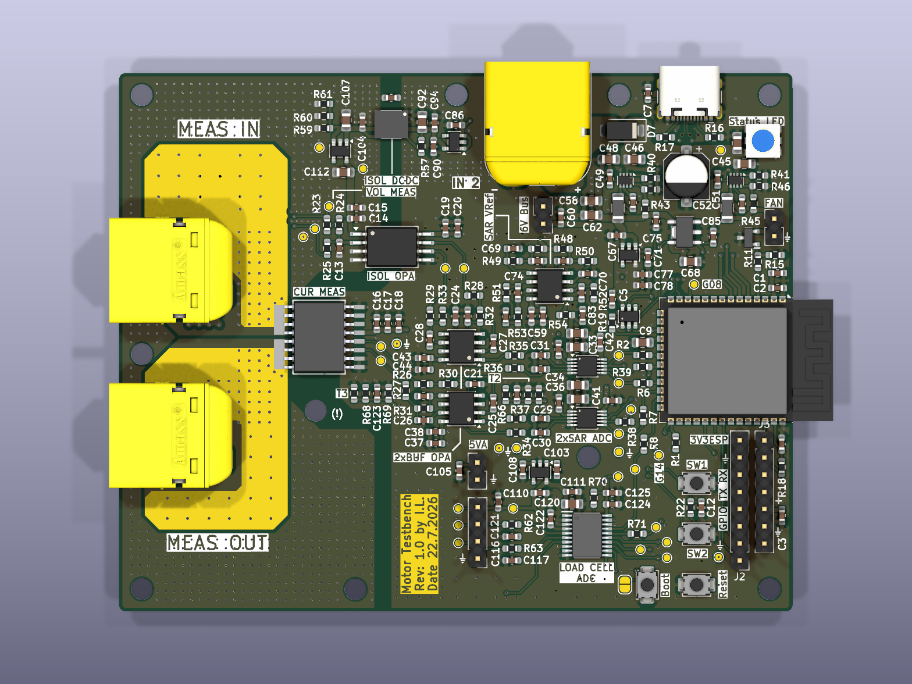
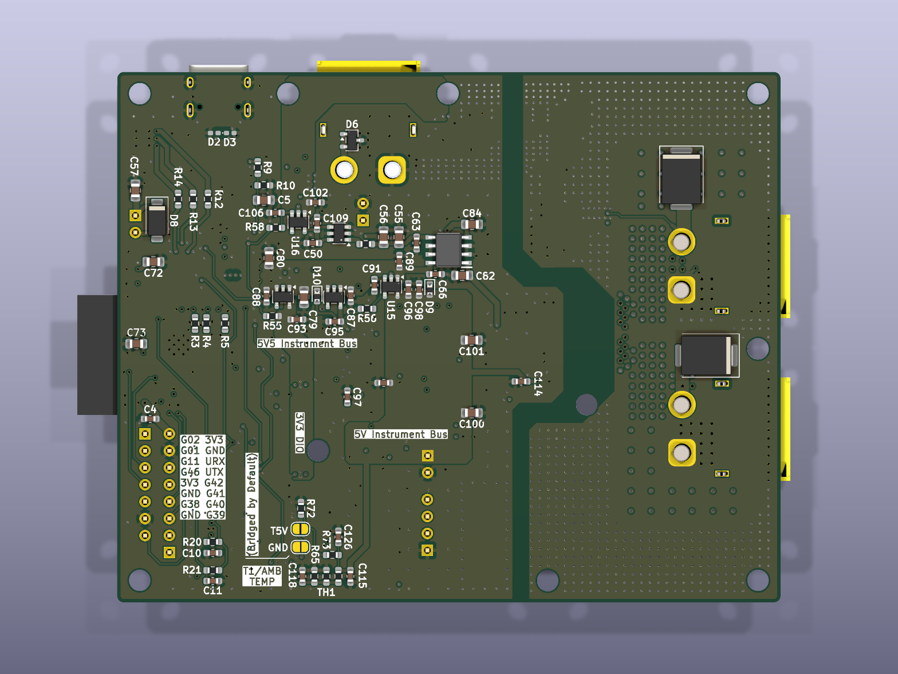
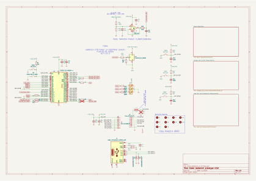

<!-- KICAD_DIFF_GEN_START -->

 <b>Top</b>

 <b>Bottom</b>

 <b>Schematic — Page 1</b>

 <b>Power Regulation — Page 2</b>

 <b>Voltage And Current Measurements — Page 3</b>

 <b>Load Cell And Temperature Measurements — Page 4</b>

---
## 🛠 Technical Hardware Summary
*Autogenerated by GitHub Command Center*

### 📋 Project Overview
| Metric | Value |
| :--- | :--- |
| **Board Dimensions** | 99.5 x 79.51 mm |
| **Total Area** | 7910.75 mm² |
| **Layer Count** | 6 Copper Layers |
| **Total Components** | 286 |
| **SMD Components** | 244 |
| **THT Components** | 9 |
| **Unique Parts** | 72 |
| **DRC Status** | ⚠️ 27 Errors, 106 Warnings |
| **KiCad Version** | 10.0.4 |

### 📐 Manufacturing & DRC
| Metric | Value |
| :--- | :--- |
| **Vias** | 1443 Total (1443 TH, 0 Blind, 0 Micro) |

### 📄 Architecture
- **Digital Buses:** `ESP_UART_RX, ESP_UART_TX, ESP_USB_D+, ESP_USB_D-`
- **Power Domains:** `+3V3, GND, GNDREF`

### ⚙️ Mechanical
- **Mounting Holes:** 10 (H10 (MountingHole_3.2mm_M3), H9 (MountingHole_3.2mm_M3), H7 (MountingHole_3.2mm_M3), H1 (MountingHole_3.2mm_M3), H8 (MountingHole_3.2mm_M3), H6 (MountingHole_3.2mm_M3), H2 (MountingHole_3.2mm_M3), H5 (MountingHole_3.2mm_M3), H4 (MountingHole_3.2mm_M3), H3 (MountingHole_3.2mm_M3))

### 🚫 Do Not Populate (DNP)
- C100 (22u)
- C101 (22u)
- C105 (1u)
- C126 (1u)
- C60 (1u)
- C8 (1u)
- C99 (100p)
- R18 (22R)
- R40 (R)
- R41 (R)
- R59 (220R)
- R60 (220R)
- R61 (220R)
- R72 (10k)
- R73 (10k)
- R8 (22R)

### 📝 Project TODOs
- TODO: Check Min / Max stable capacitances for the LDOS
- TODO: FIND PROPER 6V 800mA INPUT TO 3V3 LDO
- TODO: MAADOITA NÄMÄ?
- TODO: TARKASTA PINOUT: TLV9001SIDBVRG4\n
- TODO: VAIHDA TÄHÄN\nMouser No:\n637-PSOT36\nMfr. No:\nPSOT36
- TODO:\n\nVARMISTA ETTÄ PINNIT JA FOOTPRINT OIKEAT:\nPJA3402_R1_00001\nSOT-23-3\n

### 🧠 Core ICs & Modules
| Reference | Component | Function / Description |
| :--- | :--- | :--- |
| IC6 | [MCP3564RT-E_ST](https://componentsearchengine.com/search.html?searchString=MCP3564RT-E/ST) | Analog to Digital Converters - ADC 24-bit delta-sigma ADC w/Vref, Quad channel, 3V |
| IC1 | [PJA3402_R1_00001](https://componentsearchengine.com/search.html?searchString=PJA3402_R1_00001) | MOSFETs 30V N-Channel Enhancement Mode MOSFET |
| U1 | ESP32-S3-WROOM-1 | RF Module, ESP32-S3 SoC, Wi-Fi 802.11b/g/n, Bluetooth, BLE, 32-bit, 3.3V, onboard antenna, SMD |
| U2 | OPA310SxDBV | Single Rail-to-Rail Input/Output Operational Amplifier with Shutdown, 1.5..5.5V supply, 3MHz GBW, 250uV offset voltage, 150mA output current, SOT-23-6 |
| U8 | TPS62933 | 3.8-30V, 3A Synchronous Buck Converters with pulse frequency modulation (PFM), SOT583-8 |
| IC4 | [AP7361C-33Y5-13](https://componentsearchengine.com/search.html?searchString=AP7361C-33Y5-13) | DIODES INC. - AP7361C-33Y5-13 - LDO, FIXED, 3.3V, 1A, -40 TO 85DEG C |
| U10 | OPA2387DR | Precision, 10-MHz, Low-Noise, Low-Power, RRIO, CMOS Operational Amplifier, SOIC-8 |
| IC3 | [NCV8184DR2G](https://componentsearchengine.com/search.html?searchString=NCV8184DR2G) | 70 mA Source Capability; Output Tracks within +/- 3m V; Low Input Voltage Tracking Performance (Works Down to Vref = 2.0 V); Low Dropout (0.35 V Typ.@50 mA); Low Quiescent Current; Thermal Shutdown; AEC Qualified; PPAP Capable |
| U14 | TPS7A2018PDBVRG4 | TPS7A2018PDBVRG4 |
| U9 | TPS62933 | 3.8-30V, 3A Synchronous Buck Converters with pulse frequency modulation (PFM), SOT583-8 |
| U18 | TPS7A2045PDBVR | TPS7A2045PDBVR |
| IC5 | [MIE1W0505BGLVH-3R-P](https://componentsearchengine.com/search.html?searchString=MIE1W0505BGLVH-3R-P) | Isolated DC/DC Converters - SMD Next gen ultra small size isolated power module |
| U7 | MCP1502T-50E/CHY | Voltage References 50 ppm 0.1% Voltage Reference |
| U11 | TPS7A2055PDBVR | TPS7A2055PDBVR |
| U16 | TPS7A2055PDBVR | TPS7A2055PDBVR |
| U15 | TPS7A2050PDBVR | TPS7A2050PDBVR |
| U13 | TPS7A2033PDBVR | TPS7A2033PDBVR |
| U17 | TPS7A2033PDBVR | TPS7A2033PDBVR |
| U12 | TPS7A2050PDBVR | TPS7A2050PDBVR |
| U3 | [CZ3723](https://componentsearchengine.com/search.html?searchString=CZ3A05) | Board Mount Current Sensors 60A Precise unipolar Coreless Current Sensor w/UL61800 |
| U6 | OPA2328DR | Precision, 10-MHz, Low-Noise, Low-Power, RRIO, CMOS Operational Amplifier, SOIC-8 |
| U4 | AMC1351DWV | Precision Reinforced Isolated Amplifier, 5V Input, 300 kHz Bandwidth, 0.4V/V, 0.2% Gain Tolerance, Differential Output, SOIC-8 |
| U5 | OPA2328DR | Precision Amplifiers Dual-channel precis ion 50-uV offset vo |

### 🔌 Connectors & Interfaces
| Reference | Type | Component | Description |
| :--- | :--- | :--- | :--- |
| J11 | Connector | Conn_01x04_Pin | Generic connector, single row, 01x04, script generated |
| J3 | Connector | Conn_01x07_Pin | Generic connector, single row, 01x07, script generated |
| J1 | Connector | USB_C_Receptacle_USB2.0_16P | USB 2.0-only 16P Type-C Receptacle connector |
| J2 | Connector | Conn_01x08_Pin | Generic connector, single row, 01x08, script generated |
| J10 | Connector | Conn_01x02_Pin | Generic connector, single row, 01x02, script generated |
| J7 | Connector | Conn_01x02_Pin | Generic connector, single row, 01x02, script generated |
| J8 | Connector | Conn_01x02_Pin | Generic connector, single row, 01x02, script generated |
| J6 | Connector | V_bat_secondary | Generic connector, single row, 01x02, script generated |
| J5 | Connector | [XT60PW-M](https://componentsearchengine.com/search.html?searchString=XT60PW-M) | Connector: DC supply; socket; XT60; male; PIN: 2; on PCBs; THT; 30A |
| J4 | Connector | [XT60PW-M](https://componentsearchengine.com/search.html?searchString=XT60PW-M) | Connector: DC supply; socket; XT60; male; PIN: 2; on PCBs; THT; 30A |

### 📏 Passive Components
| Component | Breakdown |
| :--- | :--- |
| Capacitor | 97x0603, 28x0805 and 1xOther |
| Diode | 2x0402, 2x0603 and 6xOther |
| Inductor | 1x1206 |
| Resistor | 73x0603 |

---
<!-- KICAD_DIFF_GEN_END -->
